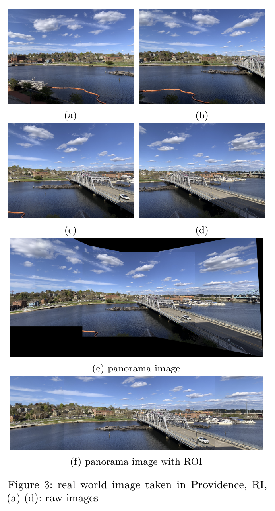

# Automatic Panoramic Image Stitching 

In this project, we build panorama image stitching with unordered data from [Automatic Panoramic Image Stitching using Invariant Features](http://matthewalunbrown.com/papers/ijcv2007.pdf). We focused on finding local features to find matches between all of the images in a data set. Also, we successfully stitched images into panoramas using SURF features, RANSAC feature matching, homography, etc. After applying ROI the final outcome seems more elegant which can be directly used for advertisement sor business promotions.



## Requirements:
* Python >= 3.5
* Python >= 1.8
* OpenCV 3.4.2.16

## Install
```
git clone git@github.com:Kyan820815/CSCI1430-Final-Project.git
cd CSCI1430-Final-Project
```

## Run
```
	main.py [-h] [--data {shanghai,lab,river,indoor,road,hotel}]
               	 [--candidate CANDIDATE] [--lowe_ratio LOWE_RATIO]
                 [--ransac_th RANSAC_TH] [--roi_improve ROI_IMPROVE]
```

optional arguments:
```
  -h, --help            show this help message and exit
  --data {shanghai,lab,river,indoor,road,hotel}
                        Choose what image you'd like to run on: one of listed
                        above
  --candidate CANDIDATE
                        Choose number of candidate
  --lowe_ratio LOWE_RATIO
                        Choose lowe ratio used in feature matching
  --ransac_th RANSAC_TH
                        Choose ransac threshold value used in finding
                        homography
  --roi_improve ROI_IMPROVE
                        Set true for those images with roi do not have good
                        result
```

## Data
The data set is on: https://www.dropbox.com/sh/kui1xs38o15xbaw/AACxJ7g6ci0qz_nG0rjujIcMa?dl=0\
Please create data folder in the code directory and result folder in the data folder

